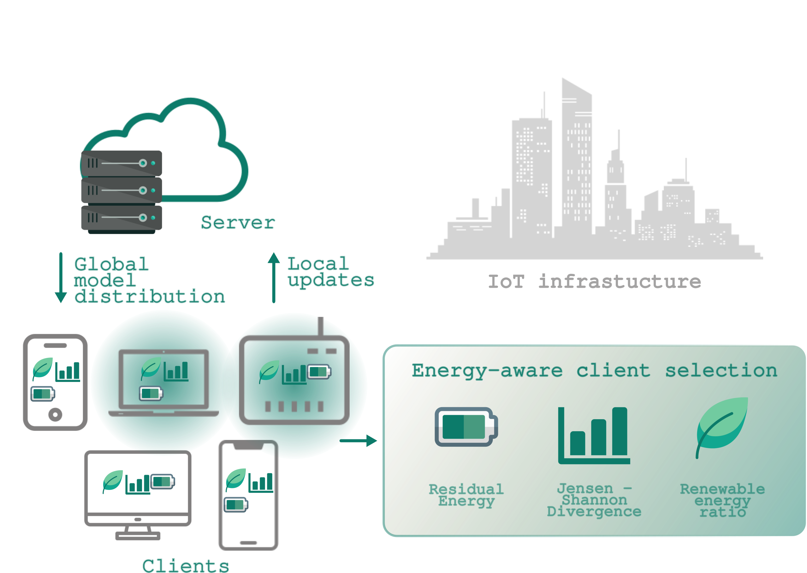

# SAGE: Sustainable And Green Energy-aware client selection for Federated Learning in IoT

## Abstract
The Internet of Things (IoT) is widely adopted in industrial applications and smart infrastructures, enabling large-scale data collection and intelligent services. However, the distributed nature of IoT networks introduces significant energy challenges, as devices often operate under heterogeneous conditions and with highly variable energy availability. Ensuring the sustainability of such systems requires adaptive energy management strategies and localized processing techniques that reduce unnecessary energy usage while preserving reliable performance. Federated Learning (FL) has emerged as a promising paradigm for IoT, allowing the collaborative training of a global model on a server aggregating parameters from different devices, the clients, without exposing private data. Nevertheless, the repetitive communication and computation inherent to FL can exacerbate energy constraints. To minimize energy consumption, communication strategies such as model compression can be used to transmit updates, or client selection (CS), to select clients that can effectively improve the global model with their updates. 

Our work introduces SAGE, a novel energy efficient CS strategy tailored for distributed IoT scenarios. Unlike conventional methods, the proposed approach jointly considers the residual energy available at each client device, the Jensen–Shannon divergence (JSD) as a statistical measure of data dissimilarity, and the proportion of renewable energy in the client’s power supply. By combining these factors, the method not only improves energy balancing across the network but also promotes the prioritization of renewable energy usage, enhancing both system efficiency and environmental sustainability while maintaining competitive model accuracy.



## Data Availability
In our experiments, we used the CIFAR-10 dataset, a widely adopted benchmark for image classification in machine learning research. CIFAR-10 consists of **60,000 color images** in 10 different classes, with 6,000 images per class. The dataset is publicly available and can be freely downloaded from the official [CIFAR website](https://www.cs.toronto.edu/~kriz/cifar.html).  

## Installation
### 1. **Clone the repository:**
```bash
git clone https://github.com/MODAL-UNINA/SAGE.git
cd SAGE
```

### 2. **Set up the environment:**
In order to run the SAGE framework, a dedicated Python environment must be configured with the necessary dependencies. This can be easily achieved by using the provided `environment.yml` file to create a conda environment. Then, activate it:

```bash
conda env create -f Files_yaml/environment.yml
conda activate sage
```

## FL Training
This section describes how to configure and run trainings experiments with **SAGE**

### 1. Configuration
The following parameters can be set when executing `main.py` to customize the training process:

| Parameter       | Description  |
|-----------------|--------------|
| `epochs`        | Number of communication rounds. |
| `num_users`     | Total number of clients. |
| `frac`          | Fraction of clients sampled in each round. |
| `local_ep`      | Number of local training epochs per selected client. |
| `bs`            | Test batch size. |
| `local_bs`      | Local training batch size. |
| `lr`            | Learning rate. |
| `momentum`      | SGD momentum. |
| `weight_decay`  | Weight decay. |
| `algorithm`     | Federated Learning algorithm. Options: `SAGE`, `FedAvg`, `FedProx`. |
| `Dirichlet_arg` | Concentration parameter of the Dirichlet distribution (for Non-IID). |
| `a`             | Weight assigned to **residual energy** in the optimization problem. |
| `b`             | Weight assigned to **data divergence** in the optimization problem. |
| `c`             | Weight assigned to **renewable energy ratio** in the optimization problem. |
| `k`             | Minimum number of clients to be selected in each round. |
| `prox_alpha`    | Proximal term coefficient for **FedProx**. Typical values: `1e-1`, `1e-2`, `1e-3`, `1e-4`. |
| `max_energy`    | Maximum energy capacity of clients (default: `15.0`). |
| `gpu`           | GPU index to use (default: `0`). |


### 2. Execution
To start training, run the `main.py` script with the desired configuration. For example if you want to run a training session with the SAGE algorithm and with a Dirichlet parameter equal to 0.1, you can use the following command:

```bash
python main.py --epochs 1500 --num_users 50 --frac 0.2 --local_ep 5 --bs 128 --local_bs 1024 --lr 0.01 --momentum 0.5 --algorithm SAGE --Dirichlet_arg 0.1 --a 0.5 --b 0.3 --c 0.2 --k 2 --max_energy 15.0 
``` 

